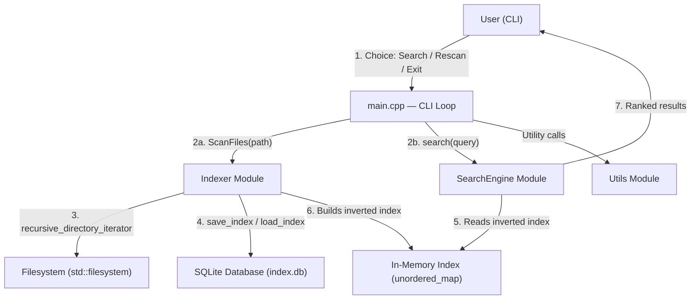

# Trace Local Search Engine

A local file-search tool built in C++17 that indexes filenames on your computer recursively and allows you to search for them using keywords with instant query results.

---
## Overview

This project is a command-line file-search utility. It scans a configured folder on your hard drive, breaks every filename into keywords (tokens), and persists those keywords in a local SQLite database index. When you search for a file, it looks up your query keywords in the database and shows you matching files, sorted by relevance based on how many keywords each file matched.

I built this as a learning project to understand how search engines work at a fundamental level — specifically **inverted indexes**, **tokenization**, and **relevance ranking**. It started as a single-file procedural program and was gradually refactored into a modular, object-oriented design with SQLite-based persistence.

The project is in an early/prototype stage. The core pipeline is fully functional — you can scan a directory, save the index, reload it, and search — but there are known limitations and several features planned for the future.

---

## Features

### Implemented

- ✅ **Recursive Directory Scanning**: Traverses directory structures recursively using C++17 `std::filesystem`.
- ✅ **Unified Tokenization**: Splits filenames and search queries on common delimiters (`_`, `.`, `-`, spaces, parentheses, brackets) to handle diverse naming conventions.
- ✅ **CamelCase Tokenization**: Splits camelCase terms (e.g., `MyReport` into `["my", "report"]`) to support searching by constituent words.
- ✅ **Case-Insensitive Search**: Lowercases all tokens at both index and search time for robust matching.
- ✅ **In-Memory Cache**: Populates an inverted index in memory (`unordered_map<string, unordered_set<string>>`) from SQLite on start for sub-millisecond query lookups.
- ✅ **SQLite Persistence**: Saves the index database (`index.db`) locally so you don't need to re-scan every time you start the tool.
- ✅ **High-Performance Transactions**: Uses transactional database writes (`BEGIN`/`COMMIT`) and prepared statements to batch index saves, achieving over a 100x speedup compared to individual row inserts.
- ✅ **Relevance Ranking**: Matches queries using a union-based (OR) logic and ranks results based on token frequency (files matching more keywords rank higher).
- ✅ **Intersection Search**: Includes a set-intersection algorithm (`searchwithintersection`) to find files matching *all* keywords (implemented and ready, currently not exposed in the main CLI menu).
- ✅ **CLI menu**: Offers an interactive, console-driven menu with options to search, rescan, or exit.
- ✅ **Graceful Error Handling**: Wraps filesystem walks in try-catch blocks to skip permission-denied system directories without crashing.

### Not Yet Implemented / Planned

- 🚧 Searching inside file contents (only filenames are indexed)
- 🚧 Fuzzy/approximate matching (typos won't find results)
- 🚧 Configurable scan directory from the command line (currently hardcoded to `D:\Downloads` in `main.cpp`)
- 🚧 File metadata search (size, date, extension filters)
- 🚧 Modern build system (no CMakeLists.txt or Makefile yet)
- 🚧 Automated unit tests
- 🚧 Incremental re-indexing (currently re-scans the full directory)
- 🚧 Automatic pruning of stale/deleted files from the database

---

## Architecture

The project has four main parts:



### Indexer ([src/Indexer/](file:///d:/Downloads/MINI_SEARCH_ENGINE-main/MINI_SEARCH_ENGINE-main/src/Indexer/))

Responsible for:
- Walking through folders recursively and finding all files.
- Building the in-memory inverted index mapping each keyword to a set of matching file paths.
- Serializing that index to `index.db` using SQLite prepared statements and transactions.
- Deserializing the database back into memory upon application startup.

### SearchEngine ([src/SearchEngine/](file:///d:/Downloads/MINI_SEARCH_ENGINE-main/MINI_SEARCH_ENGINE-main/src/SearchEngine/))

Handles search queries and scoring:
- Receives the inverted index from `Indexer` via dependency injection (a `const` reference is passed to the constructor to avoid copying).
- Tokenizes search queries using the unified tokenizer.
- Scores matching files based on the count of matching tokens and sorts them so the most relevant files appear first.
- Offers a set-intersection method for exact AND matches.

### Utils ([src/Utils/](file:///d:/Downloads/MINI_SEARCH_ENGINE-main/MINI_SEARCH_ENGINE-main/src/Utils/))

Shared helper functionality:
- `Tokenize()` — A unified string tokenizer that splits on delimiters (`_`, `.`, `-`, spaces, `(`, `)`, `[`, `]`) and converts all letters to lowercase. This resolves previous issues where the indexer and search engine used mismatched tokenization rules.
- `input()` — Prompts the user and safely reads a line of input (supporting space characters).

### SQLite ([src/Indexer/sql/](file:///d:/Downloads/MINI_SEARCH_ENGINE-main/MINI_SEARCH_ENGINE-main/src/Indexer/sql/))

Vendors the SQLite amalgamation (the entire database engine as a single `.c` and `.h` file pair). This is compiled and linked directly into the binary — eliminating the need for an external database server or external DLLs.

The database schema is simple:
```sql
CREATE TABLE file_index (
    token      TEXT,
    file_paths TEXT,
    UNIQUE(token, file_paths)
);
```

---

## Example Workflow

```
1. Application starts
2. Checks if "index.db" exists on disk
   ├── YES → Loads the saved index into memory (fast)
   └── NO  → Scans the filesystem recursively (slower, first run only)
              → Saves the index to "index.db"
3. User sees the menu:
   ┌─────────────────────────┐
   │ 1. Search for a file    │
   │ 2. Rescan files         │
   │ 3. Exit                 │
   └─────────────────────────┘
4. User types: "report pdf"
5. Engine tokenizes query → ["report", "pdf"]
6. Looks up each token in the index:
   "report" → { fileA, fileB }
   "pdf"    → { fileA, fileC }
7. Scores:
   fileA → 2 (matched both tokens)
   fileB → 1 (matched "report" only)
   fileC → 1 (matched "pdf" only)
8. Returns results sorted by score:
   fileA
   fileB
   fileC
```

---

## Project Structure

```
MINI_SEARCH_ENGINE/
│
├── src/                          # ★ Active Source Code
│   ├── main.cpp                  # Entry point and CLI menu loop
│   ├── Indexer/                  # Indexer module
│   │   ├── sql_indexer.h         # Indexer class declaration
│   │   ├── sql_indexer.cpp       # Indexer implementation
│   │   ├── sql/                  # Vendored SQLite3 C library
│   │   │   ├── sqlite3.h         # SQLite header
│   │   │   ├── sqlite3.c         # SQLite source amalgamation
│   │   │   ├── sqlite3ext.h      # SQLite extension API
│   │   │   ├── sqlite3.o         # Pre-compiled SQLite object file
│   │   │   └── shell.c           # SQLite command-line tool source
│   │   └── old/                  # Legacy Indexer version (archived)
│   │       ├── Indexer.h
│   │       └── Indexer.cpp
│   ├── SearchEngine/             # SearchEngine module
│   │   ├── SearchEngine.h        # SearchEngine class & SearchResult struct
│   │   └── SearchEngine.cpp      # Query processing & ranking logic
│   └── Utils/                    # Shared utilities
│       ├── utils.h               # Tokenize & input declarations
│       └── utils.cpp             # Tokenize & input implementations
│
├── experiments/                  # ★ Standalone Algorithm Experiments
│   ├── header.h                  # Legacy prototypes header
│   ├── functions.cpp             # Early indexer experiments
│   ├── intersection.cpp          # Set-intersection algorithm test
│   ├── trie.cpp                  # Trie data structure prototype
│   ├── neural.cpp                # Scratchpad for basic neural net experiments
│   ├── syntax_test.cpp           # C++ STL syntax learning scripts
│   ├── tokenization_testing.cpp  # Tokenizer testing logic
│   └── sqllite.cpp/              # SQLite integration tests
│       ├── main.cpp
│       ├── test.cpp
│       ├── indexing.db
│       └── test.db
│
├── old/                          # ★ Archived: original monolithic C++ prototype
│   ├── header.h
│   └── functions.cpp
│
├── .gitignore                    # Git ignore configuration
├── compile_command.txt           # Sample compile command document
├── fact.py                       # Combinatorics scratch notes (gitignored)
├── index.db                      # Generated SQLite database file (gitignored)
├── todo.md                       # Structured checklist and future roadmap
└── README.md                     # Project overview and guide (this file)
```

---

## Technical Challenges Solved

### Tokenization Mismatch

Filenames don't follow a single naming convention. `project_report.pdf`, `Project-Report.pdf`, and `project(report).pdf` should all be searchable by "project" and "report". 

Initially, the indexer and search engine used separate, slightly different tokenization methods. The indexer split on 8 delimiters, whereas the search engine split on only 4. This resulted in an inconsistency where file paths containing `()` or `[]` were indexed under token segments that the search engine could not match. This challenge was resolved by refactoring the tokenization logic into a single shared utility `Tokenize()` under `src/Utils/utils.cpp`, ensuring consistent token extraction across both modules.

### Relevance Ranking

Simply returning all files that match *any* keyword produces too many results for common queries. I implemented a scoring system where each file's score equals the number of query tokens it matched. This ensures that a file matching 3 out of 3 query keywords appears above a file matching only 1. While simple (not yet utilizing TF-IDF or BM25), it significantly improves output quality.

### Persistence with SQLite

The first iteration saved the index to a pipe-delimited text file. It was slow for large directory structures and vulnerable to corruption. Switching to SQLite using prepared statements and transactions was a massive improvement. Wrapping batch index updates in a single transaction (`BEGIN` / `COMMIT`) avoids disk sync overhead on every insert, making index saves virtually instant.

### Recursive File Traversal

Using `std::filesystem::directory_iterator` with recursion is straightforward, but system/hidden directories often trigger permission-denied errors. Handling these gracefully via try-catch blocks and `fs::directory_options::skip_permission_denied` keeps the scanner running smoothly without crashing the app.

---

## Technical Learnings

- **Inverted Indexes**: Gained a deep understanding of why maps of terms-to-documents are the backbone of search, making lookups extremely fast compared to linear scans.
- **Hash Maps in Practice**: Practical experience with `std::unordered_map` and `std::unordered_set` hash collisions, lookups, and memory footprint tradeoffs.
- **SQLite C API**: Worked directly with `sqlite3_prepare_v2`, prepared statement parameter binding, transactions, and state resets.
- **Refactoring & Clean Code**: Refactoring the codebase from a monolithic procedural block to clean classes utilizing dependency injection and shared utility folders.
- **Modern C++**: Heavy utilization of C++17 `std::filesystem`, structured bindings, range-based loops, and move semantics.

---

## Current Limitations

| Limitation | Detail |
| :--- | :--- |
| **Filename-only search** | Only filenames are indexed. File contents are never read or searched. |
| **Hardcoded scan path** | The directory to scan is hardcoded to `D:\Downloads` in `main.cpp`. |
| **No fuzzy matching** | Typos in queries won't match (e.g., searching "reprot" won't match "report"). |
| **No incremental updates** | Re-scanning rebuilds the entire database index from scratch. |
| **Stale entries persist** | If a file is deleted from disk, its entry stays in the database until a full re-scan is run. |
| **No build system** | No Makefile or CMake file is included; compiles via direct g++ shell commands. |
| **No unit tests** | Lacks automated unit testing frameworks. |
| **Windows-oriented** | Hardcoded Windows paths (`D:\\`) mean it requires modification to run on Linux/macOS. |
| **No result pagination** | All results print at once, which can flood the terminal for generic queries. |
| **CamelCase acronym splitting** | All-caps acronyms (e.g., `NAME`) are split into single-character tokens (`["n", "a", "m", "e"]`) by the camelCase splitting algorithm. |

---

## Roadmap

### Short-Term

- [x] Move tokenization into Utils and share it between Indexer and SearchEngine.
- [x] Complete `LoadIndex()` workflow.
- [x] Remove duplicated tokenization logic.
- [x] Add CamelCase tokenization (e.g., `MyReport` → `["my", "report"]`).
- [ ] Improve ranking beyond simple token counts (implement TF-IDF or BM25).
- [ ] Add metadata storage (extension, size, modified date).
- [ ] Clean project structure and remove dead code.
- [ ] Add README screenshots and architecture diagrams.

### Medium-Term

- [ ] Metadata-based filtering (by size, date, etc.).
- [ ] Extension filtering (e.g., search only `.pdf` files).
- [ ] Incremental re-indexing (only update changed files).
- [ ] Trie-based search suggestions / auto-complete.
- [ ] Search benchmarks.

---

## Build Instructions

### Prerequisites

- A C++17 compatible compiler (e.g., GCC 8+, MSVC 2017+, or Clang 7+)
- Windows (see path requirements in `main.cpp`)

### Compile

1. Open a terminal and navigate to the `src` directory:
   ```bash
   cd src
   ```

2. If the SQLite object file `sqlite3.o` does not exist in `Indexer/sql/`, compile it first:
   ```bash
   gcc -c Indexer/sql/sqlite3.c -o Indexer/sql/sqlite3.o
   ```

3. Compile and link the project:
   ```bash
   g++ -std=c++17 -o search.exe main.cpp Indexer/sql_indexer.cpp SearchEngine/SearchEngine.cpp Utils/utils.cpp Indexer/sql/sqlite3.o
   ```

### Configuration

Before building, open [src/main.cpp](file:///d:/Downloads/MINI_SEARCH_ENGINE-main/MINI_SEARCH_ENGINE-main/src/main.cpp) and set the path you want to index on line 11:

```cpp
fs::path MyPath = "D:\\Downloads";  // ← Change this to your target directory
```

---

## Usage

```bash
$ ./search.exe

1. Search for a file
2. Rescan files
3. Exit
Enter your choice: 1
Enter Target File Name: lecture notes

D:\University\lecture_notes_chapter3.pdf
D:\University\lecture-notes-final.docx
```

- **Option 1**: Enter one or more search keywords. Results are displayed sorted by relevance.
- **Option 2**: Re-scans the target folder and updates the database.
- **Option 3**: Exits the program.

On the very first run, scanning might take a moment. On subsequent runs, the SQLite index will load almost instantly.
