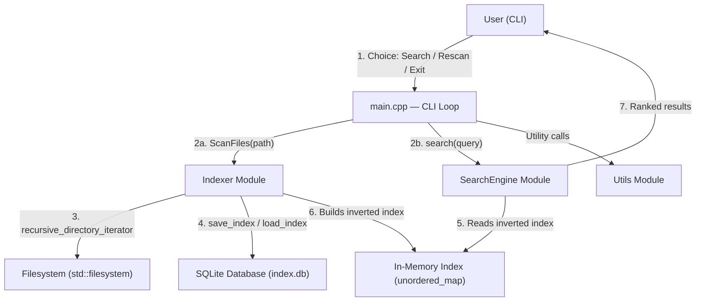
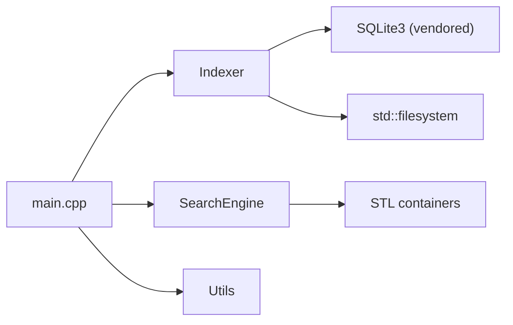
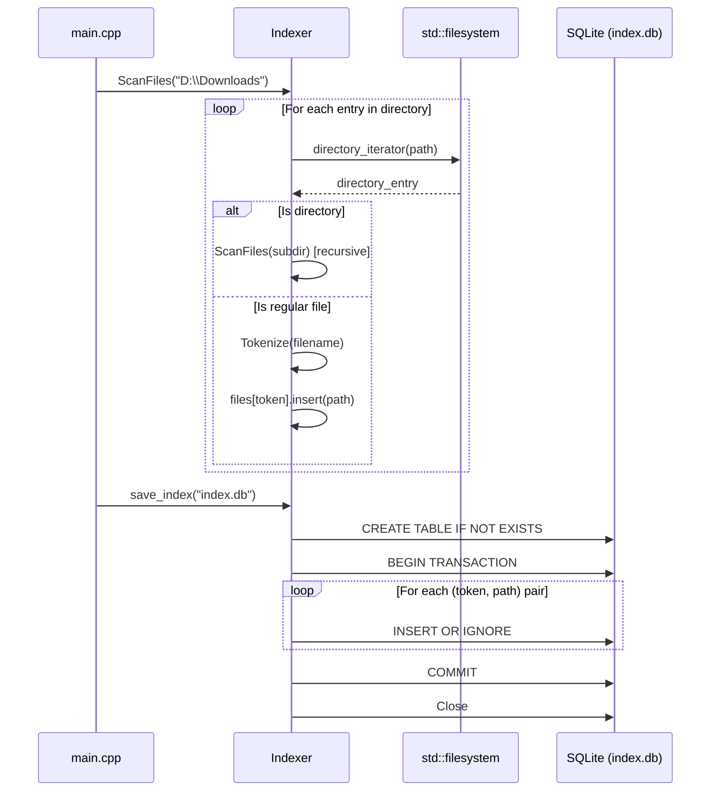
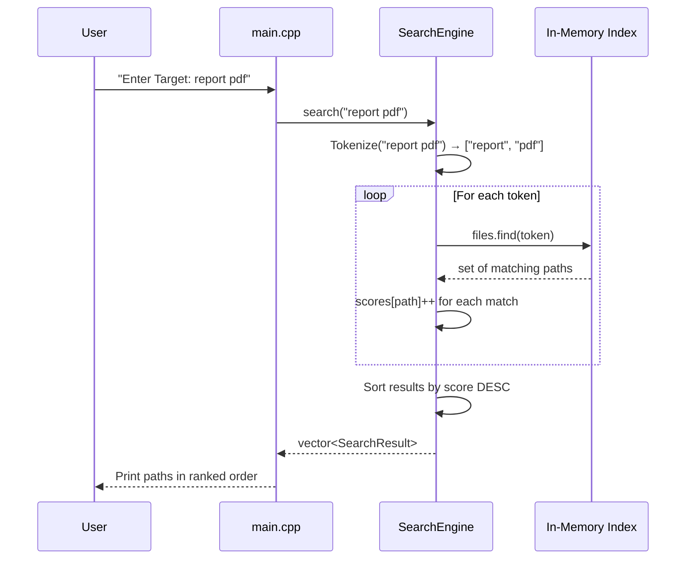

# Mini Search Engine — Project Documentation

> **Version**: 1.0 (Current)
> **Language**: C++17
> **Platform**: Windows (MSVC / MinGW)
> **Persistence**: SQLite 3 (embedded)
> **Last Analyzed**: June 2026

---

## Table of Contents

1. [Project Overview](#project-overview)
2. [Folder Structure](#folder-structure)
3. [Architecture Overview](#architecture-overview)
4. [Core Components](#core-components)
5. [Algorithms](#algorithms)
6. [Data Models](#data-models)
7. [Execution Flow](#execution-flow)
8. [Current Features](#current-features)
9. [Missing Features](#missing-features)
10. [Technical Debt](#technical-debt)
11. [Improvement Roadmap](#improvement-roadmap)
12. [Resume / Portfolio Summary](#resumeportfolio-summary)

---

# Project Overview

## Purpose

The **Mini Search Engine** is a local file-search utility written in C++17. It recursively scans a directory tree on disk, tokenizes every filename into searchable keywords, stores the resulting **inverted index** in an SQLite database, and lets users query for files by natural-language-style keyword input. Results are ranked by a token-match frequency score.

## Current Development Stage

The project is in **active early development / prototype** stage. The core indexing and search pipeline is functional, but the codebase still carries significant experimental scaffolding (`experiments/`, `old/`), hardcoded paths, and missing production-readiness features (no build system, no tests, no CLI argument parsing).

## Main Objectives

| # | Objective | Status |
|---|-----------|--------|
| 1 | Recursively scan a directory and index all filenames | ✅ Implemented |
| 2 | Tokenize filenames into searchable keywords | ✅ Implemented |
| 3 | Persist the index to disk for fast subsequent loads | ✅ Implemented (SQLite) |
| 4 | Search the index by multi-keyword queries | ✅ Implemented |
| 5 | Rank results by relevance | ✅ Basic scoring |
| 6 | Provide an interactive CLI interface | ✅ Implemented |
| 7 | Support re-scanning / index refresh | ✅ Implemented |

---

# Folder Structure

```
MINI_SEARCH_ENGINE-main/
│
├── .git/                          # Git repository metadata
├── .gitignore                     # Ignores *.txt, *.exe, *.o, *.db, *.py
├── compile_command.txt            # Sample CLI session output (not a build file)
├── fact.py                        # Unrelated: combinatorics scratch notes
├── index.db                       # Pre-built SQLite index (binary artifact)
├── main.exe                       # Root-level compiled binary (stale)
├── search.exe                     # Alternate compiled binary (stale)
│
├── src/                           # ★ ACTIVE SOURCE CODE
│   ├── main.cpp                   # Application entry point & CLI loop
│   ├── main.exe                   # Compiled binary
│   │
│   ├── Indexer/                   # Indexing module
│   │   ├── sql_indexer.h          # Indexer class declaration
│   │   ├── sql_indexer.cpp        # Indexer implementation (SQLite persistence)
│   │   ├── sql/                   # Embedded SQLite amalgamation
│   │   │   ├── sqlite3.h          # SQLite public API header (690 KB)
│   │   │   ├── sqlite3.c          # SQLite amalgamation source (9.5 MB)
│   │   │   ├── sqlite3ext.h       # SQLite extension header
│   │   │   ├── sqlite3.o          # Pre-compiled SQLite object file
│   │   │   └── shell.c            # SQLite CLI shell source
│   │   └── old/                   # Previous file-based Indexer (superseded)
│   │       ├── Indexer.h
│   │       └── Indexer.cpp
│   │
│   ├── SearchEngine/              # Search & ranking module
│   │   ├── SearchEngine.h         # SearchEngine class + SearchResult struct
│   │   └── SearchEngine.cpp       # Search & intersection implementations
│   │
│   ├── Utils/                     # Shared utility functions
│   │   ├── utils.h                # ToLower, input declarations
│   │   └── utils.cpp              # Implementations
│   │
│   └── data/                      # Empty — reserved for future data files
│
├── old/                           # ★ ARCHIVED: monolithic v0 (procedural)
│   ├── header.h                   # All-in-one header with free functions
│   └── functions.cpp              # All logic in one file
│
└── experiments/                   # ★ EXPERIMENTAL: algorithm prototypes
    ├── header.h                   # Experiment-specific header (multimap era)
    ├── functions.cpp              # Experiment functions (multimap → set migration)
    ├── intersection.cpp           # Set-intersection search prototype
    ├── trie.cpp                   # Trie data-structure proof of concept
    ├── neural.cpp                 # Linear regression / neural net experiment
    ├── syntax_test.cpp            # C++ unordered_map syntax learning
    ├── tokenization_testing.cpp   # Tokenizer unit-test scratch file
    └── sqllite.cpp/               # SQLite integration prototype
        ├── main.cpp               # Early SQLite indexer (no load_index)
        ├── test.cpp               # SQL INSERT statement generator test
        ├── indexing.db            # Test database
        └── test.db                # Test database
```

### Folder Purpose Summary

| Folder | Purpose |
|--------|---------|
| `src/` | Production-ready source code. The only code that compiles into the final binary. |
| `src/Indexer/` | Filesystem crawling, tokenization, and SQLite-backed index persistence. |
| `src/Indexer/sql/` | Vendored SQLite 3 amalgamation — the entire database engine compiled into the binary. |
| `src/Indexer/old/` | Superseded flat-file Indexer that serialized the index as pipe-delimited text. |
| `src/SearchEngine/` | Query processing, token matching, scoring, and result ranking. |
| `src/Utils/` | Shared helper functions (`ToLower`, `input`). |
| `src/data/` | Empty placeholder — likely intended for sample documents or stop-word lists. |
| `old/` | Original monolithic (procedural) codebase before the OOP refactor. |
| `experiments/` | Standalone algorithm explorations (Trie, set-intersection, neural net, SQLite). |

---

# Architecture Overview

## High-Level Architecture



## Module Responsibilities

| Module | Responsibility | Key Dependencies |
|--------|---------------|-----------------|
| **main.cpp** | Application entry point, CLI menu loop, orchestration | Indexer, SearchEngine, Utils |
| **Indexer** | Crawl filesystem, tokenize filenames, build inverted index, persist/load via SQLite | `<filesystem>`, SQLite3, `<unordered_map>` |
| **SearchEngine** | Accept query strings, tokenize them, match against index, score & rank results | Indexer's in-memory map, `<algorithm>` |
| **Utils** | Case conversion (`ToLower`), user input helper (`input`) | `<iostream>`, `<string>` |
| **SQLite3** | Embedded relational database engine (vendored amalgamation) | None (self-contained C library) |

## Dependency Graph



> [!IMPORTANT]
> The `SearchEngine` does **not** depend on the `Indexer` class directly. It receives a `const` reference to the Indexer's internal `unordered_map` via dependency injection in the constructor. This is a solid design choice.

## Data Flow

```
┌─────────────┐      ┌───────────────┐      ┌─────────────────┐
│  Filesystem  │─────▶│    Indexer     │─────▶│  SQLite (disk)  │
│  (D:\...)    │ scan │  Tokenize +   │ save │   index.db      │
└─────────────┘      │  Build Index  │      └────────┬────────┘
                     └───────┬───────┘               │ load
                             │                       │
                     ┌───────▼───────┐      ┌────────▼────────┐
                     │ In-Memory Map │◀─────│  SQLite (disk)  │
                     │ token → {paths}│      └─────────────────┘
                     └───────┬───────┘
                             │ const ref
                     ┌───────▼───────┐      ┌─────────────────┐
                     │ SearchEngine  │─────▶│  Ranked Results │
                     │ Tokenize query│      │  (SearchResult) │
                     │ Score + Sort  │      └─────────────────┘
                     └───────────────┘
```

---

# Core Components

---

## Indexer

> **Files**: [sql_indexer.h](file:///d:/Downloads/MINI_SEARCH_ENGINE-main/MINI_SEARCH_ENGINE-main/src/Indexer/sql_indexer.h) · [sql_indexer.cpp](file:///d:/Downloads/MINI_SEARCH_ENGINE-main/MINI_SEARCH_ENGINE-main/src/Indexer/sql_indexer.cpp)

### Purpose
Crawls a directory tree, extracts every regular file's name, tokenizes it into searchable keywords, and maintains an **inverted index** mapping each token to the set of file paths that contain it. Persists this index to an SQLite database for fast reloading.

### Responsibilities
- Recursive filesystem traversal
- Filename tokenization
- Inverted index construction
- SQLite serialization (`save_index`) and deserialization (`load_index`)

### Important Class

```cpp
class Indexer {
private:
    unordered_map<string, unordered_set<string>> files;  // Inverted index
    vector<string> Tokenize(const string &str);           // Tokenizer
public:
    static int callback(void*, int, char**, char**);      // SQLite row callback
    void ScanFiles(fs::path Path);                        // Recursive scan
    void save_index(string fileName);                     // Persist to SQLite
    void load_index(string fileName);                     // Load from SQLite
    const unordered_map<string, unordered_set<string>>& getFiles() const;
};
```

### Important Functions

| Function | Description |
|----------|-------------|
| [Tokenize](file:///d:/Downloads/MINI_SEARCH_ENGINE-main/MINI_SEARCH_ENGINE-main/src/Indexer/sql_indexer.cpp#L3-L22) | Splits a filename by delimiters (`_`, `.`, `-`, ` `, `(`, `)`, `[`, `]`), lowercases each token |
| [ScanFiles](file:///d:/Downloads/MINI_SEARCH_ENGINE-main/MINI_SEARCH_ENGINE-main/src/Indexer/sql_indexer.cpp#L49-L79) | Recursively iterates directories using `fs::directory_iterator`; skips errors gracefully |
| [save_index](file:///d:/Downloads/MINI_SEARCH_ENGINE-main/MINI_SEARCH_ENGINE-main/src/Indexer/sql_indexer.cpp#L80-L168) | Opens/creates SQLite DB, creates `file_index` table, inserts all token→path pairs using prepared statements inside a transaction |
| [load_index](file:///d:/Downloads/MINI_SEARCH_ENGINE-main/MINI_SEARCH_ENGINE-main/src/Indexer/sql_indexer.cpp#L171-L202) | Reads all rows from `file_index` via `SELECT *`, populates in-memory map through the static callback |
| [callback](file:///d:/Downloads/MINI_SEARCH_ENGINE-main/MINI_SEARCH_ENGINE-main/src/Indexer/sql_indexer.cpp#L24-L47) | Static SQLite callback; casts `void*` data back to the files map and inserts each (token, path) pair |

### Interactions
- **main.cpp** creates an `Indexer`, calls `ScanFiles` or `load_index`, then passes `getFiles()` to `SearchEngine`.
- **SQLite** is accessed directly via the C API (`sqlite3_open`, `sqlite3_exec`, `sqlite3_prepare_v2`, etc.).

---

## SearchEngine

> **Files**: [SearchEngine.h](file:///d:/Downloads/MINI_SEARCH_ENGINE-main/MINI_SEARCH_ENGINE-main/src/SearchEngine/SearchEngine.h) · [SearchEngine.cpp](file:///d:/Downloads/MINI_SEARCH_ENGINE-main/MINI_SEARCH_ENGINE-main/src/SearchEngine/SearchEngine.cpp)

### Purpose
Accepts a user's search query, tokenizes it, looks up each token in the inverted index, scores each matching file path by how many query tokens it contains, and returns results sorted by descending relevance.

### Responsibilities
- Query tokenization
- Token→path lookup in the inverted index
- Frequency-based scoring
- Result sorting by score
- Alternate intersection-based exact matching

### Important Class

```cpp
struct SearchResult {
    string path;
    int score;
};

class SearchEngine {
private:
    const unordered_map<string, unordered_set<string>>& files;  // Reference to index
    vector<string> Tokenize(string& str);
public:
    SearchEngine(const unordered_map<string, unordered_set<string>>& files);
    vector<SearchResult> search(string target);           // Scored search
    void searchwithintersection(string target);           // Intersection search
};
```

### Important Functions

| Function | Description |
|----------|-------------|
| [search](file:///d:/Downloads/MINI_SEARCH_ENGINE-main/MINI_SEARCH_ENGINE-main/src/SearchEngine/SearchEngine.cpp#L29-L85) | Tokenizes query → for each token, finds matching paths → increments score per path → sorts by score descending |
| [searchwithintersection](file:///d:/Downloads/MINI_SEARCH_ENGINE-main/MINI_SEARCH_ENGINE-main/src/SearchEngine/SearchEngine.cpp#L87-L117) | Finds paths that match **ALL** query tokens (set intersection). Only files containing every keyword are returned |
| [Tokenize](file:///d:/Downloads/MINI_SEARCH_ENGINE-main/MINI_SEARCH_ENGINE-main/src/SearchEngine/SearchEngine.cpp#L8-L27) | Same logic as Indexer's tokenizer but with fewer delimiters (missing `()[]`) |

### Interactions
- Receives the Indexer's `files` map via **const reference** — zero-copy, read-only access.
- Called by `main.cpp` when the user selects "Search for a file".

---

## Utils

> **Files**: [utils.h](file:///d:/Downloads/MINI_SEARCH_ENGINE-main/MINI_SEARCH_ENGINE-main/src/Utils/utils.h) · [utils.cpp](file:///d:/Downloads/MINI_SEARCH_ENGINE-main/MINI_SEARCH_ENGINE-main/src/Utils/utils.cpp)

### Purpose
Provides shared utility functions used across modules.

### Functions

| Function | Signature | Description |
|----------|-----------|-------------|
| [ToLower](file:///d:/Downloads/MINI_SEARCH_ENGINE-main/MINI_SEARCH_ENGINE-main/src/Utils/utils.cpp#L3-L9) | `string ToLower(string str)` | Converts a string to lowercase character-by-character. **Currently unused** — tokenizers inline their own lowering. |
| [input](file:///d:/Downloads/MINI_SEARCH_ENGINE-main/MINI_SEARCH_ENGINE-main/src/Utils/utils.cpp#L10-L17) | `string input(string placeholder)` | Displays a prompt, clears the input buffer, reads a full line (supports spaces). |

---

## main.cpp — Application Entry Point

> **File**: [main.cpp](file:///d:/Downloads/MINI_SEARCH_ENGINE-main/MINI_SEARCH_ENGINE-main/src/main.cpp)

### Purpose
Orchestrates the application lifecycle: index loading/building, CLI menu, search dispatch, and re-scanning.

### Flow

```
Start
  │
  ▼
Does "index.db" exist?
  ├── YES → load_index("index.db")
  └── NO  → ScanFiles("D:\\Downloads") → save_index("index.db")
  │
  ▼
Create SearchEngine with Indexer's files
  │
  ▼
CLI Loop:
  ├── 1 → Prompt for query → search() → print ranked results
  ├── 2 → ScanFiles() → save_index() → "Rescanned"
  └── 3 → Exit
```

---

# Algorithms

## 1. Tokenization Algorithm

> **Location**: [Indexer::Tokenize](file:///d:/Downloads/MINI_SEARCH_ENGINE-main/MINI_SEARCH_ENGINE-main/src/Indexer/sql_indexer.cpp#L3-L22) and [SearchEngine::Tokenize](file:///d:/Downloads/MINI_SEARCH_ENGINE-main/MINI_SEARCH_ENGINE-main/src/SearchEngine/SearchEngine.cpp#L8-L27)

**Type**: Delimiter-based character-level scanner

**Algorithm**:
```
Input:  "Project_Report-v2.pdf"
Step 1: Iterate each character
Step 2: Lowercase the character  →  "project_report-v2.pdf"
Step 3: If char ∈ {_, ., -, ' ', (, ), [, ]}  →  emit current buffer as token, reset
Step 4: Else  →  append to current buffer
Step 5: Emit final buffer if non-empty

Output: ["project", "report", "v2", "pdf"]
```

**Complexity**: O(n) where n = length of the filename string.

> [!WARNING]
> **Inconsistency**: The Indexer tokenizer recognizes 8 delimiters (`_ . - space ( ) [ ]`) but the SearchEngine tokenizer only recognizes 4 (`_ . - space`). This means a filename indexed with parenthesized tokens may not be findable by query. This is a **bug**.

---

## 2. Inverted Index Construction

> **Location**: [Indexer::ScanFiles](file:///d:/Downloads/MINI_SEARCH_ENGINE-main/MINI_SEARCH_ENGINE-main/src/Indexer/sql_indexer.cpp#L49-L79)

**Type**: Inverted index (token → document set)

**Data Structure**: `unordered_map<string, unordered_set<string>>`

**Algorithm**:
```
For each file in recursive directory traversal:
    filename ← entry.path().filename()
    tokens[] ← Tokenize(filename)
    For each token in tokens:
        index[token].insert(full_path)
```

**Complexity**: O(F × T) where F = total files, T = average tokens per filename.

**Example**:
```
Scanning: D:\Projects\my_report-final.pdf
Tokens:   ["my", "report", "final", "pdf"]

Index after insert:
  "my"     → { "D:\Projects\my_report-final.pdf" }
  "report" → { "D:\Projects\my_report-final.pdf" }
  "final"  → { "D:\Projects\my_report-final.pdf" }
  "pdf"    → { "D:\Projects\my_report-final.pdf" }
```

---

## 3. Scored Search (Union + Frequency Ranking)

> **Location**: [SearchEngine::search](file:///d:/Downloads/MINI_SEARCH_ENGINE-main/MINI_SEARCH_ENGINE-main/src/SearchEngine/SearchEngine.cpp#L29-L85)

**Type**: Token-frequency scoring with union semantics (OR logic)

**Algorithm**:
```
Input:  "report pdf"
Tokens: ["report", "pdf"]

1. Initialize scores = {}  (path → int)
2. For each query token:
     Look up index[token]
     For each path in result set:
       scores[path]++
3. Convert scores to SearchResult vector
4. Sort by score DESCENDING  (std::sort with lambda)
5. Return sorted vector

Scoring:
  - File matching 1 of 2 tokens → score = 1
  - File matching 2 of 2 tokens → score = 2  (ranked higher)
```

**Complexity**: O(Q × P + R log R) where Q = query tokens, P = average paths per token, R = total result count.

---

## 4. Intersection Search (AND Logic)

> **Location**: [SearchEngine::searchwithintersection](file:///d:/Downloads/MINI_SEARCH_ENGINE-main/MINI_SEARCH_ENGINE-main/src/SearchEngine/SearchEngine.cpp#L87-L117)

**Type**: Multi-set intersection (AND logic)

**Algorithm**:
```
Input:  "apple pie"
Tokens: ["apple", "pie"]

1. result_set ← index["apple"]        // Start with first token's paths
2. For each subsequent token:
     current_set ← index[token]
     temp_set ← result_set ∩ current_set   // Manual intersection
     result_set ← temp_set
3. Print result_set (or "Not Found")
```

**Complexity**: O(Q × |result_set|) per intersection step.

> [!NOTE]
> This method is currently **not exposed** in the CLI menu. It exists in the codebase but `main.cpp` only calls `search()`, not `searchwithintersection()`.

---

## 5. SQLite Persistence

> **Location**: [save_index](file:///d:/Downloads/MINI_SEARCH_ENGINE-main/MINI_SEARCH_ENGINE-main/src/Indexer/sql_indexer.cpp#L80-L168) · [load_index](file:///d:/Downloads/MINI_SEARCH_ENGINE-main/MINI_SEARCH_ENGINE-main/src/Indexer/sql_indexer.cpp#L171-L202)

### Schema

```sql
CREATE TABLE IF NOT EXISTS file_index (
    token      TEXT,
    file_paths TEXT,
    UNIQUE(token, file_paths)
);
```

### Save Strategy
1. Open/create SQLite database file
2. `CREATE TABLE IF NOT EXISTS` (idempotent)
3. `BEGIN` transaction (batch insert for performance)
4. Prepare `INSERT OR IGNORE INTO file_index(token, file_paths) VALUES(?, ?)`
5. Loop over all (token, path) pairs → bind → step → reset
6. `COMMIT` transaction
7. Close database

### Load Strategy
1. Open SQLite database file
2. Execute `SELECT * FROM file_index` with a static callback
3. Callback casts `void*` to `unordered_map*` and reconstructs the in-memory index
4. Close database

> [!TIP]
> The use of `INSERT OR IGNORE` with a `UNIQUE` constraint prevents duplicate entries on re-index. The transaction wrapping (`BEGIN` / `COMMIT`) dramatically improves insert throughput by batching disk writes.

---

# Data Models

## SearchResult

> **File**: [SearchEngine.h:12-16](file:///d:/Downloads/MINI_SEARCH_ENGINE-main/MINI_SEARCH_ENGINE-main/src/SearchEngine/SearchEngine.h#L12-L16)

```cpp
struct SearchResult {
    string path;   // Full filesystem path to the matched file
    int score;     // Number of query tokens that matched this path
};
```

## Inverted Index (Core Data Structure)

```cpp
unordered_map<string, unordered_set<string>> files;
//            ^^^^^^                ^^^^^^
//            token                 set of file paths
```

| Property | Detail |
|----------|--------|
| **Key** | Lowercase token extracted from a filename |
| **Value** | Set of full file paths containing that token |
| **Lookup** | O(1) average via hash table |
| **Uniqueness** | `unordered_set` prevents duplicate paths per token |

### Example State

```
{
  "report"  → { "D:\Docs\report.pdf", "D:\Work\annual_report.docx" },
  "annual"  → { "D:\Work\annual_report.docx" },
  "pdf"     → { "D:\Docs\report.pdf", "D:\Docs\invoice.pdf" },
  "invoice" → { "D:\Docs\invoice.pdf" }
}
```

## SQLite Schema

```
┌────────────────────────────────────────┐
│            file_index                  │
├──────────────┬─────────────────────────┤
│ token (TEXT) │ file_paths (TEXT)        │
├──────────────┼─────────────────────────┤
│ "report"     │ "D:\Docs\report.pdf"    │
│ "report"     │ "D:\Work\annual_re..."  │
│ "pdf"        │ "D:\Docs\report.pdf"    │
│ "pdf"        │ "D:\Docs\invoice.pdf"   │
└──────────────┴─────────────────────────┘
UNIQUE(token, file_paths)
```

---

# Execution Flow

## 1. When Indexing Starts



## 2. When Search Starts



## 3. When Results Are Ranked

1. A `scores` map (`unordered_map<string, int>`) accumulates hit counts.
2. Each time a file path appears in a token's result set, its score is incremented by 1.
3. The scores map is converted to a `vector<SearchResult>`.
4. `std::sort` with a **descending comparator** (`a.score > b.score`) orders the results.
5. Ties are broken arbitrarily (no secondary sort key).

## 4. When Data Is Saved

1. `sqlite3_open("index.db", &db)` — opens or creates the database file.
2. `CREATE TABLE IF NOT EXISTS file_index(token TEXT, file_paths TEXT, UNIQUE(token, file_paths))` — ensures schema exists.
3. `BEGIN` — starts a transaction for batch performance.
4. `INSERT OR IGNORE INTO file_index(token, file_paths) VALUES(?, ?)` — prepared statement with parameter binding.
5. Loop: bind each (token, path) pair → `sqlite3_step` → `sqlite3_reset` → `sqlite3_clear_bindings`.
6. `COMMIT` — commits all inserts atomically.
7. `sqlite3_close(db)` — closes the connection.

## 5. When Data Is Loaded

1. `files.clear()` — clears any existing in-memory data.
2. `sqlite3_open("index.db", &db)` — opens the database.
3. `SELECT * FROM file_index` — executed with the static `callback` function.
4. For each row, the callback reconstructs the `files[token].insert(path)` mapping.
5. `sqlite3_close(db)` — closes the connection.
6. The in-memory index is now fully populated and ready for queries.

---

# Current Features

| # | Feature | Description |
|---|---------|-------------|
| 1 | **Recursive Directory Scanning** | Traverses all subdirectories from a root path using `std::filesystem::directory_iterator`. |
| 2 | **Filename Tokenization** | Splits filenames into keywords using common delimiters; lowercases all tokens for case-insensitive matching. |
| 3 | **Inverted Index** | Hash-map-based inverted index mapping tokens to file-path sets for O(1) average-case lookup. |
| 4 | **SQLite Persistence** | Index is serialized to/from an SQLite database using transactions and prepared statements. Survives restarts without re-scanning. |
| 5 | **Keyword Search (OR)** | Multi-keyword queries return files matching **any** token, ranked by the number of matching tokens. |
| 6 | **Intersection Search (AND)** | Files matching **all** query tokens can be found (method exists but is not wired to UI). |
| 7 | **Result Ranking** | Results are sorted by descending match score (token-hit frequency). |
| 8 | **Index Refresh** | Users can re-scan the filesystem and overwrite the saved index on demand. |
| 9 | **Interactive CLI** | Menu-driven console interface with input validation. |
| 10 | **Error Handling** | Try-catch around filesystem operations and SQLite calls; graceful handling of permission errors. |

---

# Missing Features

> Inferred from project goals, code comments, experiment files, and industry expectations for a search engine.

| # | Missing Feature | Evidence / Reasoning |
|---|----------------|---------------------|
| 1 | **Content-based search** | Only filenames are indexed. File contents (text within PDFs, DOCX, etc.) are never read. |
| 2 | **File metadata indexing** | File size, creation date, modified date, extension, MIME type — none are indexed or searchable. |
| 3 | **Fuzzy / approximate matching** | `experiments/trie.cpp` suggests prefix-matching was explored but never integrated. No edit-distance or fuzzy search exists. |
| 4 | **Auto-complete / suggestions** | The Trie experiment could power this, but it was abandoned. |
| 5 | **Stop-word filtering** | Common words ("the", "a", "of") are indexed as tokens. No stop-word list is applied. |
| 6 | **TF-IDF or BM25 ranking** | Scoring is pure token-count. No inverse-document-frequency weighting. Common tokens like "pdf" dominate results unfairly. |
| 7 | **Configurable scan paths** | The root path is hardcoded to `D:\Downloads`. No CLI arguments or config file. |
| 8 | **Build system** | No Makefile, CMakeLists.txt, or build script. Compilation is manual. |
| 9 | **Unit / integration tests** | No test framework. Experiments serve as ad-hoc tests but aren't automated. |
| 10 | **Incremental indexing** | Re-scanning rebuilds the entire index. No diffing or timestamp-based update. |
| 11 | **Boolean query syntax** | No support for `AND`, `OR`, `NOT`, or quoted phrases. |
| 12 | **File-type filtering** | Cannot filter results by extension (e.g., "show only .pdf files"). |
| 13 | **Result pagination** | All results are printed at once. No limit or paging. |
| 14 | **GUI / Web interface** | CLI only. `experiments/neural.cpp` hints at ML interests but no GUI was attempted. |
| 15 | **Cross-platform support** | Hardcoded Windows paths (`D:\\`). No Linux/macOS adaptation. |

---

# Technical Debt

## 1. Duplicated Tokenization Logic

> **Severity**: 🔴 High

The `Tokenize()` function exists in **four separate locations** with slightly different implementations:

| Location | Delimiters | Const-correct | Safe cast |
|----------|-----------|--------------|----------|
| `Indexer::Tokenize` | `_ . - space ( ) [ ]` | ✅ `const string&` | ✅ `static_cast<unsigned char>` |
| `SearchEngine::Tokenize` | `_ . - space` | ❌ `string&` | ❌ bare `tolower(c)` |
| `old/functions.cpp::Tokenize` | `_ . - space` | ❌ `string&` | ❌ bare `tolower(c)` |
| `experiments/functions.cpp::Tokenize` | `_ . - space` | ❌ `string&` | ❌ bare `tolower(c)` |

**Impact**: The delimiter mismatch between Indexer and SearchEngine means files with `()[]` in their names are indexed under split tokens but cannot be found because the SearchEngine doesn't split on those characters.

**Fix**: Extract a single `Tokenize()` function into `Utils` and share it everywhere.

---

## 2. Hardcoded Root Path

> **Severity**: 🔴 High

```cpp
// main.cpp:6
fs::path MyPath = "D:\\Downloads";
```

The scan directory is hardcoded. This makes the application non-portable and requires recompilation to scan a different location.

---

## 3. No Include Guards on `sql_indexer.h`

> **Severity**: 🟡 Medium

[sql_indexer.h](file:///d:/Downloads/MINI_SEARCH_ENGINE-main/MINI_SEARCH_ENGINE-main/src/Indexer/sql_indexer.h) lacks `#pragma once` or traditional include guards, while other headers use `#pragma once`. This can cause multiple-inclusion errors in larger builds.

---

## 4. `using namespace std;` in Headers

> **Severity**: 🟡 Medium

Both [sql_indexer.h](file:///d:/Downloads/MINI_SEARCH_ENGINE-main/MINI_SEARCH_ENGINE-main/src/Indexer/sql_indexer.h#L10) and [SearchEngine.h](file:///d:/Downloads/MINI_SEARCH_ENGINE-main/MINI_SEARCH_ENGINE-main/src/SearchEngine/SearchEngine.h#L10) place `using namespace std;` in header files. This pollutes the global namespace for every file that includes them — a well-known C++ anti-pattern.

---

## 5. Pass-by-Value Where Pass-by-Reference Is Appropriate

> **Severity**: 🟡 Medium

```cpp
void save_index(string fileName);   // Copies the string
void load_index(string fileName);   // Copies the string
vector<SearchResult> search(string target);  // Copies the string
```

All `string` parameters should be `const string&` or `string_view` to avoid unnecessary copies.

---

## 6. No Build System

> **Severity**: 🟡 Medium

The [compile_command.txt](file:///d:/Downloads/MINI_SEARCH_ENGINE-main/MINI_SEARCH_ENGINE-main/compile_command.txt) file is actually just a sample CLI session, not a build command. There is no Makefile, CMakeLists.txt, or build script. Building requires remembering the exact `g++` command with SQLite object linking.

---

## 7. Dead / Stale Code in Repository

> **Severity**: 🟡 Medium

| Item | Status |
|------|--------|
| `old/` directory | Fully superseded by `src/`, should be removed or archived |
| `experiments/` directory | Learning artifacts, not production code; should be in a separate branch |
| `fact.py` | Unrelated combinatorics scratch — doesn't belong in repo |
| `compile_command.txt` | Misleading filename; contains a CLI session, not build commands |
| Multiple `.exe` and `.db` files | Binary artifacts committed to Git (should be `.gitignore`d) |
| `src/Indexer/old/` | Previous flat-file indexer kept inside the production source tree |
| Commented-out code blocks | Scattered throughout `sql_indexer.cpp` and `SearchEngine.cpp` |

---

## 8. Unused `ToLower()` Utility

> **Severity**: 🟢 Low

`Utils::ToLower()` is declared and implemented but never called. Each tokenizer handles lowercasing internally with inline `tolower()` calls.

---

## 9. SQLite Callback Uses `void*` Casting

> **Severity**: 🟢 Low

The [callback](file:///d:/Downloads/MINI_SEARCH_ENGINE-main/MINI_SEARCH_ENGINE-main/src/Indexer/sql_indexer.cpp#L24-L47) function uses `static_cast<unordered_map*>(data)` from `void*`. This is inherent to the SQLite C API and is correct, but it bypasses type safety. A modern alternative would be to use `sqlite3_prepare_v2` + `sqlite3_step` + `sqlite3_column_text` for row-by-row iteration, eliminating the callback pattern entirely.

---

## 10. No Index Cleanup / Staleness Detection

> **Severity**: 🟡 Medium

When a file is deleted from disk, its entries remain in the SQLite index forever. There is no mechanism to:
- Detect stale entries
- Prune deleted files
- Compare timestamps

The `INSERT OR IGNORE` prevents duplicates on re-scan, but the table accumulates references to non-existent files over time.

---

# Improvement Roadmap

## Short-Term (1–2 weeks)

| # | Improvement | Impact |
|---|-------------|--------|
| 1 | **Unify Tokenize()** into `Utils` with all 8 delimiters | Fixes the search bug; eliminates 4× duplication |
| 2 | **Add `#pragma once`** to `sql_indexer.h` | Prevents multiple-inclusion errors |
| 3 | **Remove `using namespace std;`** from headers | Follows C++ best practices |
| 4 | **Make string parameters `const&`** | Eliminates unnecessary copies |
| 5 | **Accept scan path via CLI argument** (`argv[1]`) | Makes the tool usable on any machine |
| 6 | **Clean up repository**: remove `old/`, `experiments/`, `fact.py`, binaries | Reduces clutter; cleaner Git history |
| 7 | **Add a `CMakeLists.txt`** or Makefile | Reproducible builds; easier onboarding |
| 8 | **Wire `searchwithintersection`** to a CLI menu option | Exposes already-built AND-search feature |

## Mid-Term (1–2 months)

| # | Improvement | Impact |
|---|-------------|--------|
| 1 | **TF-IDF scoring** | Better ranking; rare tokens weighted higher than "pdf" |
| 2 | **File metadata indexing** (size, date, extension) | Richer queries ("show me large PDFs from this week") |
| 3 | **Incremental indexing** with file timestamps | Avoid full re-scan; update only changed files |
| 4 | **Stale entry pruning** | Clean up references to deleted files during re-index |
| 5 | **Fuzzy matching** using edit distance or n-grams | Handle typos in queries |
| 6 | **Trie integration** for auto-complete | Leverage the existing experiment for prefix suggestions |
| 7 | **Result pagination** | Limit output to N results per page |
| 8 | **File-type filter flag** (e.g., `--type=pdf`) | Narrow results by extension |
| 9 | **Unit test framework** (GoogleTest or Catch2) | Automated regression testing |
| 10 | **Boolean query parser** (`AND`, `OR`, `NOT`, quotes) | Expressive query language |

## Long-Term (3–6 months)

| # | Improvement | Impact |
|---|-------------|--------|
| 1 | **Full-text content indexing** (PDF, DOCX, TXT parsing) | Search inside files, not just filenames |
| 2 | **BM25 ranking algorithm** | Industry-standard relevance scoring |
| 3 | **Web UI / GUI** (Qt, Electron, or browser-based) | Visual search interface with file previews |
| 4 | **Multi-threaded scanning** | Parallel filesystem traversal for large drives |
| 5 | **Cross-platform support** (Linux, macOS) | Broader user base; CI/CD pipeline |
| 6 | **Plugin architecture** | Extensible parsers for different file types |
| 7 | **Watch-based live indexing** (filesystem notifications) | Real-time index updates as files change |
| 8 | **Query result caching** | Speed up repeated queries |
| 9 | **Search analytics** | Track common queries, click-through rates |

---

# Resume / Portfolio Summary

## For GitHub README

> **Mini Search Engine** — A local file-search engine built from scratch in C++17. Recursively scans directory trees, tokenizes filenames into an inverted index stored in SQLite, and ranks multi-keyword search results by relevance score. Features include persistent indexing with transactional writes, frequency-based result ranking, set-intersection exact matching, and an interactive CLI. Designed with modular OOP architecture (Indexer → SearchEngine → Utils).

## For LinkedIn / Resume

> **Mini Search Engine** | C++17, SQLite, Data Structures & Algorithms
>
> Designed and implemented a local file-search engine from scratch demonstrating systems programming and information retrieval fundamentals:
> - Built an **inverted index** data structure mapping tokenized filename keywords to file paths using hash maps and hash sets for O(1) average-case lookups
> - Implemented **SQLite-backed persistence** with transactional batch inserts and prepared statements, enabling sub-second index loading across sessions
> - Developed two search strategies: **union-based scored search** (OR semantics with frequency ranking) and **set-intersection search** (AND semantics for exact multi-keyword matching)
> - Engineered a **recursive filesystem crawler** using C++17 `std::filesystem` with graceful error handling for permission-denied directories
> - Applied **modular OOP design** with dependency injection (SearchEngine receives index by const reference), separating concerns across Indexer, SearchEngine, and Utils modules
> - Explored advanced algorithms in experiments including **Trie-based prefix search** and **linear regression** for potential ML-powered ranking

## For Internship Applications

> This project demonstrates my ability to:
> - Design and implement **data structures** (inverted index, hash maps, sets, tries) from scratch
> - Work with **database systems** (SQLite C API: prepared statements, transactions, callbacks)
> - Apply **information retrieval concepts** (tokenization, indexing, scoring, ranking)
> - Write **modular, maintainable C++ code** with clear separation of concerns
> - Use **modern C++17 features** (`std::filesystem`, structured bindings, range-based iteration)
> - Iterate on designs: evolved from a monolithic procedural codebase to a clean OOP architecture with SQLite persistence, as documented by the project's Git history

---

> [!NOTE]
> This documentation was generated by reverse-engineering the complete source tree. For questions or contributions, start with [main.cpp](file:///d:/Downloads/MINI_SEARCH_ENGINE-main/MINI_SEARCH_ENGINE-main/src/main.cpp) as the entry point and follow the includes.
